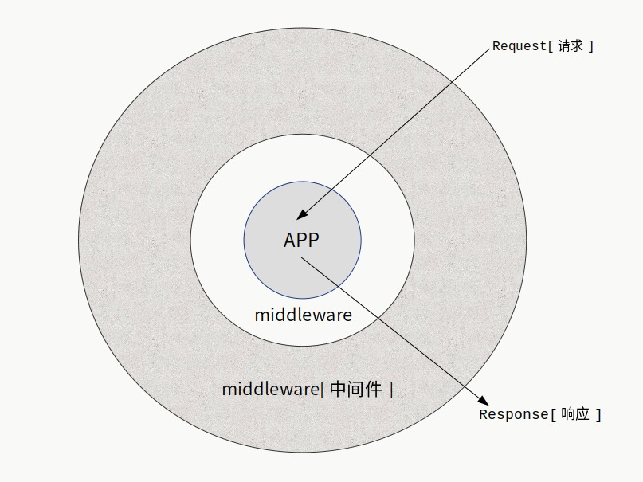
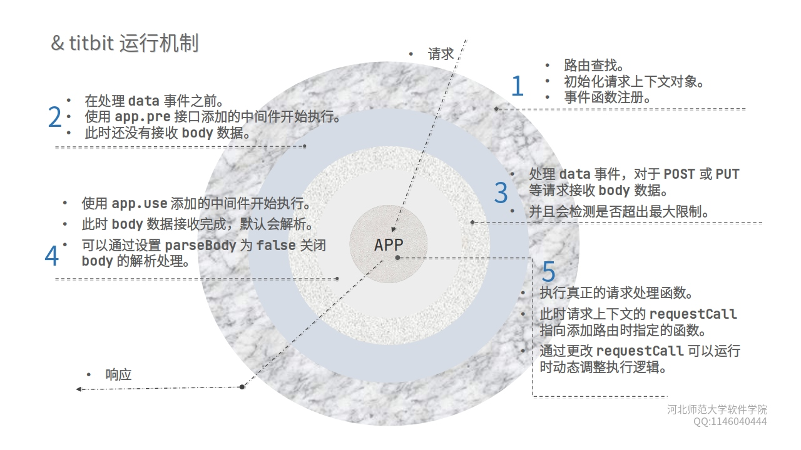

# titbit

> titbit是运行于服务端的Web框架，最开始是为了在教学中方便开发而设计，也用在一些业务系统上。它绝对算不上重型框架，但是也不简单过头。

> 有bug或是疑惑请提交issue。

> 它非常快，无论是路由查找还是中间件执行过程。

**因为github无法正常显示图片，建议使用gitee（码云）查看文档。**

[码云地址](https://gitee.com/daoio/titbit)


**Wiki中有相关主题的说明：[Wiki](https://gitee.com/daoio/titbit/wikis)**


Node.js的Web开发框架，同时支持HTTP/1.1和HTTP/2协议， 提供了强大的中间机制。


核心功能：

* 请求上下文设计屏蔽接口差异。

* 中间件模式。

* 路由分组和命名。

* 中间件按照路由分组执行。

* 中间件匹配请求方法和路由来执行。

* 开启守护进程：使用cluster模块。

* 显示子进程负载情况。

* 默认解析body数据。

* 支持通过配置启用HTTP/1.1或是HTTP/2服务。

* 支持配置启用HTTPS服务（HTTP/2服务必须要开启HTTPS）。

* 限制请求数量。

* 限制一段时间内单个IP的最大访问次数。

* IP黑名单和IP白名单。

* 在cluster模式，监控子进程超出最大内存限制则重启。

* 可选择是否开启自动负载模式：根据负载创建新的子进程处理请求，并在空闲时恢复初始状态。


## !注意

请尽可能使用最新版本。

## 安装

``` JavaScript
npm i titbit
```

## 兼容性

从最初发展到后来一段时间内，都尽可能保证大版本的兼容性。中间经历过多次比较大的演进，有时候次版本号演进也会有不兼容更新。从21.5+版本以后，只有大版本更新可能会有一些不兼容的更新，并给出不兼容项，请注意文档和Wiki。之后的两个小版本号更新都不会体现不兼容的更新。（在此之前，次要版本号仍然可以保证兼容性）


<a href="https://gitee.com/daoio/titbit/wikis/%E7%89%88%E6%9C%AC%E6%94%B9%E8%BF%9B%E8%AF%B4%E6%98%8E?sort_id=3220595" target="_blank">·重要版本改进</a>

## 最小示例

``` JavaScript
'use strict'

const titbit = require('titibit')

const app = new titbit()


app.get('/', async c => {
  //data类型为string|Buffer。可以设置c.res.encoding为返回数据的编码格式，默认为'utf8'。
  c.res.body = 'success'
})

//默认监听0.0.0.0，参数和原生接口listen一致。
app.run(1234)

```

## 路由和请求类型

HTTP的起始行给出了请求类型，也被称为：请求方法。目前的请求方法：
```
GET POST PUT DELETE OPTIONS  TRACE HEAD PATCH
```

最常用的是前面5个。对于每个请求类型，router中都有同名但是小写的函数进行路由挂载。为了方便调用，在初始化app后，可以使用app上同名的快捷调用。（框架层面仅支持这些。）

**示例：**

``` JavaScript

'use strict';

const titbit = require('titibit');

var app = new titbit({
  debug: true
});

app.get('/', async c => {
  c.res.body = 'success';
});

app.get('/p', async c => {
  c.res.body = `${c.method} ${c.routepath}`;
});

app.post('/', async c => {
  //返回上传的数据
  c.res.body = c.body;
});

app.put('/p', async c => {
  c.res.body = {
    method : c.method,
    body : c.body,
    query : c.query
  };
});

//默认监听0.0.0.0，参数和原生接口listen一致。
app.run(8080);

```


## 获取URL参数和表单数据

``` JavaScript
'use strict';

const titbit = require('titbit');

var app = new titbit();

var {router} = app;

router.get('/q', async c => {
  //URL中?后面的查询字符串解析到query中。
  c.res.body = c.query; //返回JSON文本，主要区别在于header中content-type为text/json
});

router.post('/p', async c => {
  //POST、PUT提交的数据保存到body，如果是表单则会自动解析，否则只是保存原始文本值，
  //可以使用中间件处理各种数据。
  c.res.body = c.body;
});

app.run(2019);

```

## send函数

send函数就是对c.res.body的包装，其实就是设置了c.res.body的值。并且支持第二个参数，作为状态码，默认为200。

``` JavaScript

app.get('/', async c => {
  c.send('success')
})

app.get('/randerr', async c => {
  let n = parseInt(Math.random() * 10)
  if (n >= 5) {
    c.send('success')
  } else {
    //返回404状态码
    /*
      等效于：
        c.status(404)
        c.res.body = 'not found'
    */
    c.send('not found', 404)
  }
})

app.run(1234)

```

## 路由参数

``` JavaScript
app.get('/:name/:id', async c => {
  //使用:表示路由参数，请求参数被解析到c.param
  let username = c.param.name;
  let uid = c.param.id;
  c.res.body = `${username} ${id}`;
});
app.run(8000);
```

## 任意路径参数

\* 表示任意路径，但是必须出现在路由最后。

``` JavaScript

app.get('/static/*', async c => {
  //*表示的任意路径解析到c.param.starPath
  let spath = c.param.starPath

  c.send(spath)
})

```

## 上传文件

默认会解析上传的文件，你可以在初始化服务的时候，传递parseBody选项关闭它，关于选项后面有详细的说明。
解析后的文件数据在c.files中存储，想知道具体结构请往下看。

``` JavaScript
'use strict'

const titbit = require('titbit')

const app = new titbit()

//添加中间件过滤上传文件的大小，后面有中间件详细说明。
//第二个参数表示只针对POST请求，并且路由命名为upload-image路由执行。
app.use(async (c, next) => {

  //解析后的文件在c.files中存储，通过getFile可以方便获取文件数据。
  let upf = c.getFile('image')
  if (!upf) {
    c.res.body = 'file not found'
    return
  } else if (upf.data.length > 2000000) {
    c.res.body = 'max file size: 2M'
    return
  }

  await next()
  //指定只有POST请求，并且路由名称为upload-image才会执行此中间件。
}, {method: 'POST', name: 'upload-image'});

router.post('/upload', async c => {
  let f = c.getFile('image')
  //此函数是助手函数，makeName默认会按照时间戳生成名字，extName解析文件的扩展名。
  //let fname = `${c.helper.makeName()}${c.helper.extName(f.filename)}`

  //根据原始文件名解析扩展名并生成时间戳加随机数的唯一文件名。
  let fname = c.helper.makeName(f.filename)

  try {
    c.res.body = await c.moveFile(f, fname)
  } catch (err) {
    c.res.body = err.message
  }
  
}, 'upload-image'); //给路由命名为upload-image，可以在c.name中获取。

app.run(1234)

```

## c.files数据结构

这种结构是根据HTTP协议上传文件时的数据构造设计的，HTTP协议允许同一个上传名有多个文件，所以要解析成一个数组。而使用getFile默认情况只返回第一个文件，因为多数情况只是一个上传名对应一个文件。

> 对于前端来说，上传名就是你在HTML中表单的name属性：&lt;input type="file" name="image"&gt;
> image是上传名，不要把上传名和文件名混淆。


```

{
  "image" : [
    {
      'content-type': CONTENT_TYPE,
      filename: ORIGIN_FILENAME,
      start : START,
      end   : END,
      length: LENGTH
    },
    ...
  ],

  "video" : [
    {
      'content-type': CONTENT_TYPE,  //文件类型
      filename: ORIGIN_FILENAME //原始文件名
      start : START, //ctx.rawBody开始的索引位置
      end   : END,   //ctx.rawBody结束的索引位置
      length: LENGTH,  //文件长度，字节数
    },
    ...
  ]
}
```
c.getFile就是通过名称索引，默认索引值是0，如果是一个小于0的数字，则会获取整个文件数组，没有返回null。


## 中间件

中间件是一个很有用的模式，不同语言实现起来多少还是有些区别的，但是本质上没有区别。中间件的运行机制允许开发者更好的组织代码，方便实现复杂的逻辑需求。事实上，整个框架的运行机制都是中间件模式。

中间件图示：



此框架的中间件在设计层面上，按照路由分组区分，也可以识别不同请求类型，确定是否执行还是跳过到下一层，所以速度非常快，而且多个路由和分组都具备自己的中间件，相互不冲突，也不会有无意义的调用。参考形式如下：

``` JavaScript

/*
  第二个参数可以不填写，表示全局开启中间件。
  现在第二个参数表示：只对POST请求方法才会执行，并且路由分组必须是/api。
  基于这样的设计，可以保证按需执行，不做太多无意义的操作。
*/
app.add(async (c, next) => {
    console.log('before');
    await next();
    console.log('after');
}, {method: 'POST', group: '/api'});

```

使用add添加的中间件是按照添加顺序逆序执行，这是标准的洋葱模型。为了提供容易理解的逻辑，提供use接口添加中间件，使用use添加的中间件按照添加顺序执行。不同的框架对实现顺序的逻辑往往会不同，但是顺序执行更符合开发者习惯。

**建议你最好只使用use来添加中间件：**

``` JavaScript
//先执行
app.use(async (c, next) => {
  let start_time = Date.now()
  await next()
  let end_time = Date.now()
  console.log(end_time - start_time)
})

//后执行
app.use(async (c, next) => {
  console.log(c.method, c.path)
  await next()
})

//use可以级联: app.use(m1).use(m2)
//在21.5.4版本以后，不过这个功能其实根本不重要
//因为有titbit-loader扩展，实现的功能要强大的多。

```

## titbit完整的流程图示




## 中间件参数

使用use或者pre接口添加中间件，还支持第二个参数，可以进行精确的控制，传递选项属性：

* group  路由分组，表示针对哪个分组执行。

* method 请求方法，可以是字符串或数组，必须大写。

* name  请求名称，表示只针对此请求执行。

示例：

```

app.get('/xyz', async c => {
  //...
  //路由分组命名为proxy
}, {group: 'proxy'})

app.use(proxy, {
  method : ['PUT', 'POST', 'GET', 'DELETE', 'OPTIONS'],
  //针对路由分组proxy的请求执行。
  group : 'proxy'
})
```


## pre 在接收body数据之前

使用pre接口添加的中间件和use添加的主要区别就是会在接收body数据之前执行。可用于在接收数据之前的权限过滤操作。其参数和use一致。

为了一致的开发体验，你可以直接使用use接口，只需要在选项中通过pre指定：

```
let setbodysize = async (c, next) => {
    //设定body最大接收数据为~10k。
    c.maxBody = 10000;
    await next();
};

//等效于app.pre(setbodysize);
app.use(setbodysize, {pre: true});

```

使用pre可以进行更复杂的处理，并且可以拦截并不执行下一层，比如titbit-toolkit扩展的proxy模块利用这个特性直接实现了高性能的代理服务，但是仅仅作为框架的一个中间件。其主要操作就是在这一层，直接设置了request的data事件来接收数据，并作其他处理，之后直接返回。


## 配置选项

应用初始化，完整的配置选项如下

``` JavaScript
  {
    //此配置表示POST/PUT提交表单的最大字节数，也是上传文件的最大限制。
    maxBody   : 8000000,

    //最大解析的文件数量
    maxFiles      : 12,

    daemon        : false, //开启守护进程

    /*
      开启守护进程模式后，如果设置路径不为空字符串，则会把pid写入到此文件，可用于服务管理。
    */
    pidFile       : '',

    //是否开启全局日志，true表示开启，这时候会把请求信息输出或者写入到文件
    globalLog: false,

    //日志输出方式：stdio表示输出到终端，file表示输出到文件
    logType : 'stdio',

    //正确请求日志输出的文件路径
    logFile : '',

    //错误请求日志输出的文件路径
    errorLogFile : '',

    //自定义日志处理函数
    logHandle: null,

    //开启HTTPS
    https       : false,

    http2   : false,

    //HTTPS密钥和证书的文件路径，如果设置了路径，则会自动设置https为true。
    key   : '',
    cert  : '',

    //服务器选项都写在server中，在初始化http服务时会传递，参考http2.createSecureServer、tls.createServer
    server : {
      handshakeTimeout: 8192, //TLS握手连接（HANDSHAKE）超时
      //sessionTimeout: 350,
    },

    //设置服务器超时，毫秒单位，在具体的请求中，可以再设置请求的超时。
    timeout   : 18000,

    debug     : false,

    //忽略路径末尾的 /
    ignoreSlash: true,

    //启用请求限制
    useLimit: false,

    //最大连接数，0表示不限制
    maxConn : 1024,

    //单个IP单位时间内的最大连接数，0表示不限制
    maxIPRequest: 0,

    //单位时间，默认为1秒
    unitTime : 1,
    
    //展示负载信息，需要通过daemon接口开启cluster集群模式
    showLoadInfo : true,

    //负载信息的类型，text 、json、--null
    //json类型是给程序通信使用的，方便接口开发
    loadInfoType : 'text',

    //负载信息的文件路径，如果不设置则输出到终端，否则保存到文件
    loadInfoFile : '',

    //404要返回的数据
    notFound: 'Not Found',
    
    //400要返回的数据
    badRequest : 'Bad Request',

    //控制子进程最大内存使用量的百分比参数，范围从-0.42 ～ 0.36。基础数值是0.52，所以默认值百分比为80%。
    memFactor: 0.28,

    //url最大长度
    maxUrlLength: 2048,

    //请求上下文缓存池最大数量。
    maxpool: 4096,

    //子进程汇报资源信息的定时器毫秒数。
    monitorTimeSlice: 640,

    //在globalLog为true时，全局日志是否记录真实的IP地址，主要用在反向代理模式下。
    realIP: false,

    //允许的最大query参数个数。
    maxQuery: 12,

    //是否启用strong模式，启用后会使用process处理rejectionHandled 和 uncaughtException事件，
    //并捕获一些错误：TypeError,ReferenceError,RangeError,AssertionError,URIError,Error。
    strong: false,

  };
  // 对于HTTP状态码，在这里仅需要这两个，其他很多是可以不必完整支持，并且你可以在实现应用时自行处理。
  // 因为一旦能够开始执行，就可以通过运行状态返回对应的状态码。
  // 而在这之前，框架还在为开始执行洋葱模型做准备，不过此过程非常快。

```

## 请求上下文

请求上下文就是一个封装了各种请求数据的对象。通过这样的设计，把HTTP/1.1 和 HTTP/2协议的一些差异以及Node.js版本演进带来的一些不兼容做了处理，出于设计和性能上的考虑，对于HTTP2模块，封装请求对象是stream，而不是http模块的IncomingMessage和ServerResponse（封装对象是request和response）。

**请求上下文属性和基本描述**

| 属性 | 描述 |
| ---- | ---- |
| version | 协议版本，字符串类型，为'1.1' 或 '2'。 |
| major | 协议主要版本号，1、2、3分别表示HTTP/1.1 HTTP/2 HTTP/3（目前还没有3）。 |
| maxBody | 支持的最大请求体字节数，数字类型，默认为初始化时，传递的选项maxBody的值，可以在中间件中根据请求自动设定。 |
| method | 请求类型，GET POST等HTTP请求类型，大写字母的字符串。 |
| host | 服务的主机名，就是request.headers['host']的值。 |
| protocol | 协议字符串，不带冒号，'https'、'http'、'http2'。 |
| path | 具体请求的路径。 |
| routepath | 实际执行请求的路由字符串。 |
| query | url传递的参数。 |
| param | 路由参数。 |
| files | 上传文件保存的信息。 |
| body | body请求体的数据，具体格式需要看content-type，一般为字符串或者对象，也可能是buffer。 |
| port | 客户端请求的端口号。 |
| ip | 客户端请求的IP地址，是套接字的地址，如果使用了代理服务器，需要检测x-real-ip或是x-forwarded-for消息头获取真正的IP。 |
| headers | 指向request.headers。 |
| isUpload | 是否为上传文件请求，此时就是检测消息头content-type是否为multipart/form-data格式。 |
| name | 路由名称，默认为空字符串。 |
| group | 路由分组，默认为空字符串。 |
| reply | HTTP/1.1协议，指向response，HTTP/2 指向stream。 |
| request | HTTP/1.1 就是http模块request事件的参数IncomingMessage对象，HTTP/2 指向stream对象。 |
| response | HTTP/1.1 是http模块的request事件的第二个参数response对象。HTTP/2没有此属性。 |
| box | 默认为空对象，可以添加任何属性值，用来动态传递给下一层组件需要使用的信息。 |
| service | 用于依赖注入的对象，指向app.service。 |
| res | 一个对象包括encoding、body属性，用来暂存返回数据的编码和具体数据。 |
| helper | 指向helper模块，提供了一些助手函数，具体参考wiki。 |
| send | 函数，用来设置res.body的数据并支持第二个参数作为状态码，默认状态码为200。 |
| moveFile | 函数，用来移动上传的文件到指定路径。 |
| status | 函数，设置状态码。 |
| setHeader | 函数，设置消息头。 |
| getFile | 函数，获取上传的文件信息，其实就是读取files属性的信息。 |


注意：send函数只是设置ctx.res.body属性的值，在最后才会返回数据。和直接进行ctx.res.body赋值没有区别，只是因为函数调用如果出错会更快发现问题，而设置属性值写错了就是添加了一个新的属性，不会报错但是请求不会返回正确的数据。

## 依赖注入

请求上下文中有一项是service，指向的是app.service。当初始化app后，一切需要开始就初始化好的数据、实例等都可以挂载到app.service。

``` JavaScript

'use strict';

const titbit = require('titbit');

var app = new titbit({
  debug: true
});

//有则会覆盖，没有则添加。
app.addService('name', 'first');
app.addService('data', {
  id : 123,
  ip : '127.0.0.1'
});

/*
这可能看不出什么作用，毕竟在一个文件中，直接访问变量都可以，如果要做模块分离，就变得非常重要了。
*/
app.get('/info', async c => {

  c.res.body = {
    name : c.service.name,
    data : c.service.data
  };

});

app.run(1234);

```

## daemon和run

run接口的参数为：port、host。host默认为0.0.0.0。还可以是sockPath，就是.sock文件路径，本质上是因为http的listen接口支持。使用.sock，host就被忽略了。

daemon的前两个参数和run一致，支持第三个参数是一个数字，表示要使用多少个子进程处理请求。默认为0，这时候会自动根据CPU核心数量创建子进程。之后，会保持子进程数量的稳定，在子进程意外终止后会创建新的子进程补充。

**cluster模式，最多子进程数量不会超过CPU核心数量的2倍。**

示例：

```

//host默认为0.0.0.0，端口1234
app.run(1234)

//监听localhost，只能本机访问
app.run(1234, 'localhost')

//使用两个子进程处理请求，host默认为0.0.0.0
app.daemon(1234, 2)

//使用3个子进程处理请求
app.daemon(1234, 'localhost', 3)

```

## 日志

框架本身提供了全局日志功能，当使用cluster模式时（使用daemon接口运行服务），使用初始化选项globoalLog可以开启全局日志，并且可以指定日志文件，在单进程模式，会把日志输出到终端，此时利用输出重定向和错误输出重定向仍然可以把日志保存到文件。

除了保存到文件和输出到终端进行调试，还可以利用logHandle选项设置自己的日志处理函数。

**设置了logHandle，logFile和errorLogFile会失效，具体请看代码。**

示例：

``` JavaScript

const titbit = require('titbit')

const app = new titbit({
  debug: true,
  //全局日志开启
  globalLog: true,

  //表示输出到文件，默认为stdio表示输出到终端。
  logType: 'file'

  //返回状态码为2xx或者3xx
  logFile : '/tmp/titbit.log',

  //错误的日志输出文件，返回状态码4xx或者5xx
  errorLogFile: '/tmp/titbit-error.log',

  //自定义处理函数，此时logFile和errorLogFile会失效。
  //接收参数为(worker, message)
  //worker具体参考cluster的worker文档
  /*
    msg为日志对象，属性：
      {
        type : '_log',
        success : true,
        log : '@ GET | https://localhost:2021/randst | 200 | 2020-10-31 20:27:7 | 127.0.0.1 | User-Agent'
      }
  */
  logHandle : (w, msg) => {
    console.log(w.id, msg)
  }

})

app.daemon(1234, 3)

```

使用中间件的方式处理日志和全局日志并不冲突，而如果要通过中间件进行日志处理会无法捕获没有路由返回404的情况，因为框架会先查找路由，没有则会返回。这时候，不会有请求上下文的创建，直接返回请求，避免无意义的操作。

而且，这样的方式其实更加容易和cluster模式结合，因为在内部就是利用master和worker的通信机制实现的。

## 消息事件处理

基于message事件，在daemon模式（基于cluster模块），提供了一个setMsgEvent函数用于获取子进程发送的事件消息并进行处理。

这要求worker进程发送的消息必须是一个对象，其中的type属性是必需的，表示消息事件的名称。其他字段的数据皆可以自定义。

使用方式如下：

``` JavaScript

const titbit = require('titbit')
const cluster = require('cluster')

const app = new titbit({
  debug: true,
  loadInfoFile: '/tmp/loadinfo.log'
})

if (cluster.isMaster) {
  app.setMsgEvent('test-msg', (worker, msg, handle) => {
    //子进程中会通过message事件收到消息
    worker.send({
      id : worker.id,
      data : 'ok'
    })

    console.log(msg)
  })
} else {
  //接收worker.send发送的消息
  process.on('message', msg => {
    console.log(msg)
  })

  setIneterval(() => {
    process.send({
      type : 'test-msg',
      pid : process.pid,
      time : (new Date()).toLocaleString()
    })
  }, 1000)

}

```

## 让服务自动调整子进程数量

通过daemon传递的参数作为基本的子进程数量，比如：

``` JavaScript

//使用2个子进程处理请求。
app.daemon(1234, 2)

```

如果需要自动根据负载创建子进程，并在负载空闲时终止进程，维持基本的数量，可以使用autoWorker接口来设置一个最大值，表示最大允许多少个子进程处理请求，这个值必须要比基本的子进程数量大才会生效。

```

//最大使用9个子进程处理请求。
app.autoWorker(9)

//...

app.daemon(1234, 2)

```

当负载过高时，会自动创建子进程，并且在空闲一段时间后，会自动终止连接数量为0的子进程，恢复到基本的数值。

**此功能在v21.9.6+版本可用。**


## 其他

- titbit在运行后，会有一个最后包装的中间件做最终的处理，所以设置c.res.body的值就会返回数据，默认会检测一些简单的文本类型并自动设定content-type（text/plain,text/html,text/xml,text/json）。注意这是在你没有设置content-type的情况下进行。

- 默认会限制url的最大长度，也会根据硬件情况设定一个最大内存使用率。

- 这一切你都可以通过配置选项或是中间件来进行扩展和重写，既有限制也有自由。

- 它很快，并且我们一直在都在关注优化。如果你需要和其他对比测试，请都添加多个中间件，并且都添加上百个路由，然后测试对比。

- 提供了一个sched函数用来快速设置cluster模式的调度方式，支持参数为'rr'或'none'，本质就是设置cluster.schedulingPolicy的值。


框架在初始化会自动检测内存大小并设定相关上限，你可以在初始化后，通过更改secure中的属性来更改限制，这需要你使用daemon接口，也就是使用master管理子进程的模式。

```

var app = new titbit();

//最大内存设定为500M，但是只有在连接数为0时才会自动重启。
//这个值和diemem都是针对heap（堆）的。
app.secure.maxmem = 500000000;

//必须要重启的最大内存上限设定为600M
//这个值一般要比maxmem大，当内存使用超过maxmem设置的值，
//但是连接不为0，这时候如果继续请求超过diemem设置的值，则会直接重启进程。
app.secure.diemem = 600000000;

//最大内存使用设置为2G
//注意这是总的内存使用，包括你用Buffer申请的内存。

let workers = 2;
app.secure.maxrss = 2000000000 * workers;

app.get('/', async c => {
  c.send('ok');
})

app.daemon(8008, workers);

```

**注意，这需要你开启showLoadInfo选项，这是默认开启的，除非你设置为false**

在服务始化时，会根据系统的可用内存来进行自动的设置，除非你必须要自己控制，否则最好是使用默认的配置。
